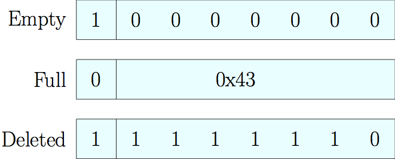

# Swiss Tables Design Notes

Abseil provides its own family of hash tables (colloquially known as "Swiss
tables”) in place of `std::unordered_set` and `std::unordered_map`. These
classes are:

* `absl::flat_hash_map`
* `absl::flat_hash_set`
* `absl::node_hash_map`
* `absl::node_hash_set`

This design note explains how these tables were implemented, the performance
improvements our tables provide in certain cases, and why those might make you
choose them over `std::unordered_{set,map}`.

## Lookup Optimizations

Swiss tables hold a densely packed array of metadata, containing presence
information for entries in the table. This presence information allows us to
optimize both lookup and insertion operations. This metadata adds one byte of
overhead for every entry in the table.

### Metadata Layout

Within Swiss tables, the result of the hash function produces a 64-bit hash
value. We split this value up into two parts:

* H1, a 57 bit hash value, used to identify the element index within the table
  itself, which is truncated and modulated as any normal hash value would be for
  lookup and insertion purposes.
* H2, the remaining 7 bits of the hash value, used to store metadata for this
  element. The H2 hash bits are stored separately within the metadata section of
  the table.

For performance reasons, it is important that you use a hash function that
distributes entropy across the entire bit space well (producing an
[avalanche effect][avalanche]. The Abseil [hash framework][absl-hash]
accomplishes this well and should be sufficient for most users.


### Metadata Information

The metadata of a Swiss table stores presence information (whether the element
is empty, deleted, or full). Each metadata entry consists of one byte, which
consists of a single control bit and the 7 bit H2 hash. The control bit, in
combination with the value in the H2 section of the metadata, indicates whether
the associated hash element is empty, present, or has been deleted.



The metadata, which is an implementation detail but can be thought of as being
laid out consecutively, maps this presence information to elements in the hash
table itself.


In this diagram, elements with the same H1 hash are colored identically, blue
elements are empty, and black represents a deleted element.

### Metadata Lookup

When searching for items in the table we use [SSE instructions][sse] to scan for
candidate matches. The process of finding an element can be roughly summarized
as follows:

1. Use the H1 hash to find the start of the "bucket chain" for that hash.
1. Use the H2 hash to construct a mask.
1. Use SSE instructions and the mask to produce a set of candidate matches.
1. Perform an equality check on each candidate.
1. If no element is found amongst the current candidates, perform probing to
   generate a new set of candidates. Note that a deleted element does not cease
   probing, though an empty element would.

Steps 2+3 can be summarized visually as:


Equivalent code for this lookup appears below:

```c++
Mask Match(h2_t hash) const {
  auto match = _mm_set1_epi8(hash);
  return Mask(_mm_movemask_epi8(_mm_cmpeq_epi8(match, metadata)));
}
```

This process is an important performance trick. Because we can winnow 16
candidates down to only those with a matching H2 hash in only a few
instructions, we are functionally searching very deep probe chains
inexpensively.

## Storage Optimizations

In addition to optimizations made in relation to element insertion and lookup,
Swiss tables were designed to also optimize certain operations that were
especially non-performant on `std::unordered_map`.

### Allocation Optimizations

In STL containers, `emplace()` will almost always:

* Allocate a value_type on the heap.
* Try to insert the allocated entry.
* If the insert fails, delete the allocated entry.

We avoid this allocation in all cases where the key can be inferred from the
arguments of `emplace()` without running user-defined constructors.


```c++
absl::flat_hash_map<int64, string> m = {{0, ""}};
// No objects of type `string` are constructed in the following code.
m.emplace(0, "abc");
m.emplace(std::make_pair(0, "abc"));
m.emplace(std::piecewise_construct,
          std::forward_as_tuple(0),
          std::forward_as_tuple("abc"));
```


The same optimization is applied for `insert()` operations.

### Move Optimizations

Similarly, we separate a hash element's `value_type` (the type of an entry) from
its `init_type` (the type from which an entry can be constructed) to allow
insertions to consume arguments. This allows initializers to `std::move()` on
construction instead of requiring a copy.

```c++
// No strings are copy-constructed in this example.
// std::unordered_map would have performed one string copy.
absl::flat_hash_map<string, int> m;
m.insert({"hello", 42});
```

As well, for both copy and move operations, `try_emplace()`, if the insertion
does not occur because the key already exists, will neither copy nor move
(respectively) the original elements.

## Credits

NOTE: The design and implementation of Swiss tables involved many people, but
in particular, we'd like to acknowledge the major contributions (in alphabetical
order) of
[Sam Benzaquen](mailto:sbenza@google.com),
[Alkis Evlogimenos](mailto:alkis@google.com),
[Matt Kulukundis](mailto:kfm@google.com), and
[Roman Perepelitsa](mailto:roman.perepelitsa@gmail.com).

[cppcon]: https://www.youtube.com/watch?v=ncHmEUmJZf4
[avalanche]: https://en.wikipedia.org/wiki/Avalanche_effect
[absl-hash]: /docs/cpp/guides/hash.md
[sse]: https://en.wikipedia.org/wiki/Streaming_SIMD_Extensions
