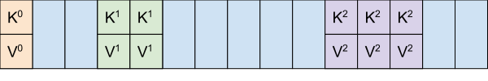
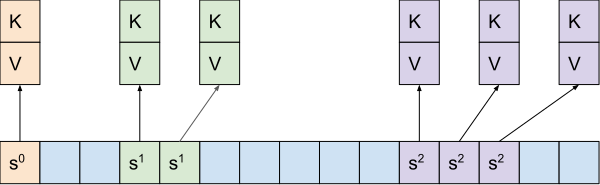

# Abseil Containers (Hash Tables)

The Abseil `container` library contains a number of useful containers generally
adhering to the STL container API contract, including a number of hash tables:

*   `absl::flat_hash_map`
*   `absl::flat_hash_set`
*   `absl::node_hash_map`
*   `absl::node_hash_set`

Collectively, these hash tables are known as "Swiss tables" and are designed to
be replacements for
[`std::unordered_map`](https://en.cppreference.com/w/cpp/container/unordered_map)
and [`std::unordered_set`](https://en.cppreference.com/w/cpp/container/unordered_set)
They provide several advantages over the `std::unordered_*` containers:

*   Provides C++11 support for C++17 mechanisms such as `try_emplace()`.
*   Supports heterogeneous lookup.
*   Allows optimizations for `emplace({key, value})` to avoid allocating a pair
    in most common cases.
*   Supports a heterogeneous `std::initializer_list` to avoid extra copies for
    construction and insertion.
*   Guarantees an `O(1)` erase method by returning void instead of an iterator.

## `absl::flat_hash_map` and `absl::flat_hash_set`

`absl::flat_hash_map` and `absl::flat_hash_set` are the recommended unordered
containers for general use. These are flat data structures, which store their
`value_type` directly in the slot array.

### Guarantees

*   Keys and values are stored inline.
*   Iterators, references, and pointers to elements are invalidated on rehash.
*   Move operations do not invalidate iterators or pointers.

### Memory Usage

{width="30%" style="margin:5px;"}

The container uses O(`(sizeof(std::pair<const K, V>) + 1) * bucket_count()`)
bytes. The *max load factor* is 87.5%, after which the table doubles in size
(making load factor go down by 2x). Thus `size()` is usually between
`0.4375*bucket_count()` and `0.875*bucket_count()`. For tables that have never
rehashed the load factor can be even lower, but these numbers are sufficient for
our estimates.

### Recommendation

Use `absl::flat_hash_map` most of the time.

## `absl::node_hash_map` and `absl::node_hash_set`

These are near drop-in replacement for `std::unordered_map` and
`std::unordered_set`. They are useful:

*   When pointer stability[^pointer-stability] is required for both key and
    value.
*   For automatic migrations from `std::unordered_map`, `std::unordered_set`,
    `hash_map` or `hash_set` where it's difficult to figure out whether the code
    relies on pointer stability.

These are node-based data structures in the STL standard sense: each
`value_type` is allocated in a separate node and the main table contains
pointers to those nodes.

### Guarantees

*   Nodes have stable addresses.
*   Iterators are invalidated on rehash.
*   Move operations do not invalidate iterators.

### Memory Usage

{width="30%" style="margin:5px;"}

The slot array requires `(sizeof(void*) + 1) * bucket_count()` bytes and the
nodes themselves require `sizeof(value_type) * size()` bytes. Together, this is
O(`9*bucket_count + sizeof(std::pair<const K, V>)*size()`) on most platforms.

### Recommendation

Prefer `absl::flat_hash_map` or `absl::flat_hash_set` in most new code (see
above).

Use `absl::node_hash_map` or `absl::node_hash_set` when pointer stability of
both keys and values is required (rare), or for code migrations from other
containers with this property. *Note:* Do not use popularity as a guide. You
will see the "node" containers used a lot, but only because it was safe to
migrate code to them from other containers.

## Construction and Usage

```cpp
absl::flat_hash_map<int, string> numbers =
    {{1, "one"}, {2, "two"}, {3, "three"}};
numbers.try_emplace(4, "four");

absl::flat_hash_map<string, std::unique_ptr<string>> strings;
strings.try_emplace("foo", absl::make_unique<string>("bar"));
```
## Heterogeneous Lookup

Inserting into or looking up an element within an associative container requires
a key. In general, containers require the keys to be of a specific type, which
can lead to inefficiencies at call sites that need to convert between
near-equivalent types (such as `std::string` and `absl::string_view`).

```cpp {.bad}
std::map<std::string, int> m = ...;
absl::string_view some_key = ...;
// Construct a temporary `std::string` to do the query.
// The allocation + copy + deallocation might dominate the find() call.
auto it = m.find(std::string(some_key));
```

To avoid this unnecessary work, the Swiss tables provide heterogeneous lookup
for conversions to string types (allowing `absl::string_view` in the lookup, for
example), and for conversions to smart pointer types (`std::unique_ptr`,
`std::shared_ptr`), through the `absl::Hash` hashing framework. (The supporting
comparators are built into `absl::Hash`.)

```cpp {.good}
absl::flat_hash_map<std::string, int> m = ...;
absl::string_view some_key = ...;
// We can use string_view directly as the key search.
auto it = m.find(some_key);
```

## Iteration Order Instability

While `std::unordered_map` makes no guarantees about iteration order, many
implementations happen to have a deterministic order based on the keys and their
insert order. This is not true of `absl::flat_hash_map` and
`absl::node_hash_map`. Thus, converting from `std::unordered_map` to
`absl::flat_hash_map` can expose latent bugs where the code incorrectly depends
on iteration order.

A special case which can create a subtle bug is summing `float` values in an
unordered container. While mathematical sums do not depend on order, floating
point sums do, and it can be the case that a sum is deterministic with
`std::unordered_set` but non-deterministic with `absl::flat_hash_set`.


## Notes

[^pointer-stability]: "Pointer stability" means that a pointer to an element
    remains valid (is not invalidated) so long as the element
    is present, allowing code to cache pointers to elements
    even when the underlying container is mutated. Saying that
    a container has pointer stability is the same as saying
    that it doesn't move elements in memory; their addresses
    do not change. Pointer stability/invalidation is the same
    as reference stability/invalidation.
