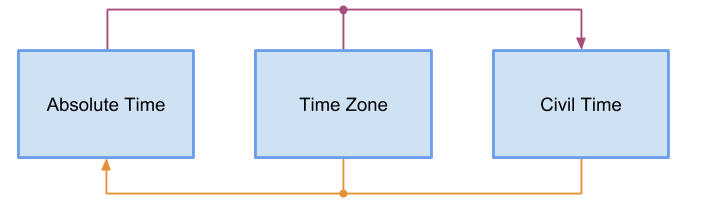
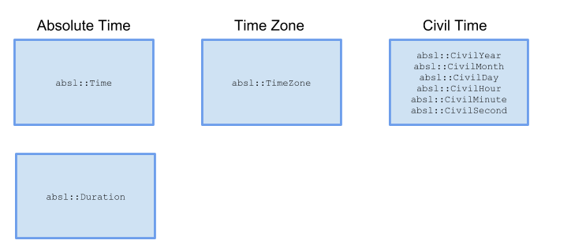

# Time Programming


This Abseil `time` library contains abstractions for holding time values, both
in terms of *absolute time* and *civil time*. The time library consists of the
following components:

* `time.h` holds abstractions for absolute time (and durations), and helper
  functions for constructing, parsing, and converting these types. Additionally,
  this header file contains support for time zones, allowing you to map between
  absolute and civil times.
* `civil_time.h` holds abstractions for civil time, and helper functions for
  constructing, parsing, and converting these types
* `clock.h` holds utility functions for creating time objects using the system
  clock

These abstractions and utility functions are documented below.

## Fundamental Concepts

[These concepts were presented at CppCon 2015:
[video here](https://youtu.be/2rnIHsqABfM) ]

There are two ways to represent time: as an *Absolute Time*, and as a *Civil
Time*. An absolute time uniquely and universally represents a specific instant
in time. Every event occurs at a specific absolute time, and everyone in the
world will agree on the absolute time when the event occurred. A `time_t` is a
well-known absolute time type. Consider the moment when Neil Armstrong first put
his left foot on the moon. He did that for the first time only once. He did not
do it again an hour later for the audience one time zone to the west. Everyone
in the world will agree on the *absolute time* when this event happened.

On the other hand, not everyone will agree on the *civil time* when that giant
leap was made. A civil time is represented as *six individual fields* that
represent a year, month, day, hour, minute, and second (aka YMDHMS). These six
fields represent the time as defined by some local government. Your civil time
matches the values shown on the clock hanging on your wall and the Dilbert
calendar on your desk. Your friend living across the country may, at the same
moment, have a different civil time showing on their Far Side calendar and
clock. For example, if you lived in New York on July 20, 1969 you witnessed Neil
Armstrong's small step at 10:56 in the evening, whereas your friend in San
Francisco saw the same thing at 7:56, and your pen pal in Sydney saw it while
eating lunch at 12:56 on July 21. You all would agree on the absolute time of
the event, but you'd disagree about the civil time.

Time zones are geo-political regions within which rules are shared to convert
between absolute times and civil times. The geographical nature of time zones is
evident in their identifiers, which look like "America/New_York",
"America/Los_Angeles", and "Australia/Sydney". A time zone's rules include
things like the region's offset from the UTC time standard, daylight-saving
adjustments, and short abbreviation strings. Since these rules may change at the
whim of the region's local government, time zones have a history of disparate
rules that apply only for certain periods. Time zones are tremendously
complicated, which is why you should always let a time library do time-zone
calculations for you.

Time zones define the relationship between absolute and civil times. Given an
absolute or civil time and a time zone, you can compute the other time, as shown
in the example below and illustrated in Figure 1.

```
Civil Time = F(Absolute Time, Time Zone)
Absolute Time = F(Civil Time, Time Zone)
```

 Figure 1

The concepts described thus far&mdash;absolute time, civil time, and time
zone&mdash;are universal concepts that apply to *all programming languages*
equally because they describe time in the real world. Different programming
languages and libraries may model these concepts differently with different
classes and sometimes even different names, but these fundamental concepts and
relationships will still exist.


## Abseil Time Constructs

The Abseil time library contains several core classes mapping to the above
concepts:

* Absolute times are represented by the `absl::Time` class. (See
  [time.h](https://github.com/abseil/abseil-cpp/blob/master/absl/time/time.h).) This is a small,
  integer-like type that should be passed around by value, and computed using
  arithmetic operators and descriptively named functions. An `absl::Time` can be
  converted to and from other absolute time representations using conversion
  functions, and to and from civil time representations with the help of an
  `absl::TimeZone`.
* Civil times are represented by six individual integers, specifying the year,
  month, day, hour, minute, and second of an `absl::Civil*` object. (See
  [civil_time.h](https://github.com/abseil/abseil-cpp/blob/master/absl/time/civil_time.h).) These
  integer values may be specified as arguments to civil-time constructors (e.g.
  `absl::CivilYear` or `absl::CivilSecond`, or parsed from a formatted time
  string.
* Time zones are represented by the `absl::TimeZone` class. (See
  [time.h](https://github.com/abseil/abseil-cpp/blob/master/absl/time/time.h).) This  mostly-opaque
  value type is passed (by value) to other Abseil time functions that will then
  perform the necessary conversions to/from absolute time or civil time. It is a
  feature that the Abseil time library itself performs all time-zone arithmetic
  on your behalf, virtually eliminating offset calculation bugs from your code.

An important auxiliary concept that has not yet been discussed is that of a
fixed-length span of time, which is represented by the `absl::Duration` class.
This small, integer-like type should be passed around by value, and computed
using normal integer-like arithmetic operators. The Abseil time library contains
several functions for converting to and from other duration types, as well as
performing floating-point operations. Durations are unit-safe, making them the
ideal type for interfaces accepting timeouts or any other fixed-length span of
time.

Figure 2 illustrates the main Abseil Time types and shows how they match the
fundamental time concepts described above.

 Figure 2

## Absolute Times with `absl::Time`

An `absl::Time` represents a specific instant in time, as a count of clock ticks
of some granularity (resolution) from some starting point (epoch). `absl::Time`
should be passed by value rather than const reference. Arithmetic operators are
provided for naturally expressing time calculations.

NOTE: although `absl::Time` resolution is guaranteed at least down to
nanoseconds, in practice it may be finer. Regardless of this fact, both the time
resolution and epoch are implementation details and you should not depend on them.
683d590da105a10713e46dde126c2d2c858791aa
`absl::Time` uses a resolution that is high enough to avoid loss in
precision, and a range that is wide enough to avoid overflow, when
converting between tick counts in most usable time scales (i.e., precision
of at least one nanosecond, and range +/-100 billion years). Conversions
between the time scales are performed by truncating (towards negative
infinity) to the nearest representable point.

`absl::Time` assumes there are 60 seconds in a minute, which means the
underlying time scales must be "smeared" to eliminate leap seconds.
See https://developers.google.com/time/smear.

### Constructing `absl::Time`

An `absl::Time` instance can be constructed directly:

```cpp
// Construct an absl::Time from the system clock. (See clock.h)
absl::Time t1 = absl::Now();

// Default construction produces an absolute time of the UNIX epoch
absl::Time t2 = absl::Time();

// For clarity, prefer constructing such times directly
absl::Time t3 = absl::UnixEpoch();
```

`absl::Time` values are commonly created from other value types. The Abseil
time library contains a number of `absl::From*()` factory functions that accept
the gamut of other time representations.

```cpp
// Construct an absl::Time from a time_t. time() returns the number of seconds
// since the UNIX epoch.
time_t tt = time(NULL);
absl::Time t1 = absl::FromTimeT(tt);

// Construct an absl::Time from a std::chrono time
auto tp = std::chrono::system_clock::from_time_t(123);
absl::Time t2 = absl::FromChrono(tp);

// Construct an absl::Time using a conversion function. (Assume MyCustomTime()
// returns microseconds since the UNIX epoch.)
int64_t unix_micros = MyCustomTime();
absl::Time t3 = absl::FromUnixMicros(unix_micros);

// Construct an absl::Time from a civil time and time zone
// (See below for more information on these types)
absl::TimeZone nyc;
// LoadTimeZone may fail so it's always better to check for success.
if (!absl::LoadTimeZone("America/New_York", &nyc)) {
  // handle error case
}
// My flight leaves NYC on Jan 2, 2017 at 03:04:05
absl::CivilSecond ct(2017, 1, 2, 3, 4, 5);
absl::Time takeoff = absl::FromCivil(ct, nyc);
```

### Formatting `absl::Time`

Formatting and parsing functions are provided for converting to and from
strings. `FormatTime()` allows you to take an absolute time and time zone and
return a string representing that time. (See [Time Zones](#timezones) below.)

```cpp
// Construct an absl::Time from the system clock.
absl::Time t1 = absl::Now();

// When formatting a time, a time zone should be passed.
absl::TimeZone utc =  absl::UTCTimeZone();
std::cout << absl::FormatTime(t1, utc);
// Outputs, e.g. "2018-08-06T23:35:32.637472794+00:00"

// The stream operator for absl::Time uses FormatTime(), using the
// absl::LocalTimeZone(). Prefer calling FormatTime() directly using an
// explicit time zone, as done above.
std::cout << t1 << "\n";
// Outputs e.g. "2018-08-06T17:35:32.637472794-04:00"
```

## Time Durations

An `absl::Duration` represents a signed, fixed-length span of time. A
`Duration` is generated using a unit-specific factory function, or is the result
of subtracting one `absl::Time` from another. Durations behave like unit-safe
integers and they support all the natural integer-like arithmetic operations.
Arithmetic overflows and saturates at +/- infinity. `Duration` should be passed
by value rather than const reference.

Factory functions `Nanoseconds()`, `Microseconds()`, `Milliseconds()`,
`Seconds()`, `Minutes()`, `Hours()` and `InfiniteDuration()` allow for creation
of constexpr `Duration` values

```cpp
constexpr absl::Duration ten_ns = absl::Nanoseconds(10);
constexpr absl::Duration min = absl::Minutes(1);
constexpr absl::Duration hour = absl::Hours(1);
absl::Duration dur = 60 * min;  // dur == hour
absl::Duration half_sec = absl::Milliseconds(500);
absl::Duration quarter_sec = 0.25 * absl::Seconds(1);
```

`Duration` values can be easily converted to an integral number of units
using the division operator.

```cpp
constexpr absl::Duration dur = absl::Milliseconds(1500);
int64_t ns = dur / absl::Nanoseconds(1);   // ns == 1500000000
int64_t ms = dur / absl::Milliseconds(1);  // ms == 1500
int64_t sec = dur / absl::Seconds(1);      // sec == 1 (subseconds truncated)
int64_t min = dur / absl::Minutes(1);      // min == 0
```

Additionally, the Abseil time library provides helper functions for converting
duration values into integers or `double` values:

* `ToInt64Nanoseconds()` and `ToDoubleNanoseconds()`
* `ToInt64Microseconds()` and `ToDoubleMicroseconds()`
* `ToInt64Milliseconds()` and `ToDoubleMilliseconds()`
* `ToInt64Seconds()` and `ToDoubleSeconds()`
* `ToInt64Minutes()` and `ToDoubleMinutes()`
* `ToInt64Hours()` and `ToDoubleHours()`

```cpp
absl::Duration d = absl::Milliseconds(1500);
int64_t isec = absl::ToInt64Seconds(d);        // isec == 1

absl::Duration d = absl::Milliseconds(1500);
double dsec = absl::ToDoubleSeconds(d);        // dsec == 1.5
```

## Civil Times

The term "civil time" refers to the legally recognized human-scale time that is
represented by the six fields `YYYY-MM-DD hh:mm:ss`. A "date" is perhaps the
most common example of a civil time. Modern-day civil time follows the Gregorian
Calendar and is a timezone-independent concept: a civil time of "2016-06-01
12:00:00", for example, is not tied to a time zone. Put another way, a civil
time does not map to a unique point in time; a civil time must be mapped to an
absolute time *through* a time zone.

Because a civil time is what most people think of as "time," it is common to map
absolute times to civil times to present to users. The Abseil time library
allows you to construct such civil times from absolute times; consult the
[time.h](https://github.com/abseil/abseil-cpp/blob/master/absl/time/time.h) for such functionality.

This library provides six classes for constructing civil-time objects, and
provides several helper functions for rounding, iterating, and performing
arithmetic on civil-time objects, while avoiding complications like
daylight-saving time (DST):

* `absl::CivilSecond`
* `absl::CivilMinute`
* `absl::CivilHour`
* `absl::CivilDay`
* `absl::CivilMonth`
* `absl::CivilYear`

Each of these civil-time types is a simple value type with the same interface
for construction and the same six accessors for each of the civil time fields
(year, month, day, hour, minute, and second, aka YMDHMS). These classes differ
only in their alignment, which is indicated by the type name and specifies the
field on which arithmetic operates.

### Civil Time Construction

Each of the civil-time types can be constructed in two ways: by directly
passing to the constructor up to six integers representing the YMDHMS fields,
or by copying the YMDHMS fields from a differently aligned civil-time type.
Omitted fields are assigned their minimum valid value. Hours, minutes, and
seconds will be set to 0, month and day will be set to 1. Since there is no
minimum year, the default is 1970.

```cpp
absl::CivilDay default_value;               // 1970-01-01 00:00:00

// Construct a civil-time object for a specific day
absl::CivilDay a(2015, 2, 3);               // 2015-02-03 00:00:00
absl::CivilDay b(2015, 2, 3, 4, 5, 6);      // 2015-02-03 00:00:00
absl::CivilDay c(2015);                     // 2015-01-01 00:00:00

// Construct a civil-time object for a specific second
absl::CivilSecond ss(2015, 2, 3, 4, 5, 6);  // 2015-02-03 04:05:06
absl::CivilMinute mm(ss);                   // 2015-02-03 04:05:00
absl::CivilHour hh(mm);                     // 2015-02-03 04:00:00
absl::CivilDay d(hh);                       // 2015-02-03 00:00:00
absl::CivilMonth m(d);                      // 2015-02-01 00:00:00
absl::CivilYear y(m);                       // 2015-01-01 00:00:00

m = absl::CivilMonth(y);                    // 2015-01-01 00:00:00
d = absl::CivilDay(m);                      // 2015-01-01 00:00:00
hh = absl::CivilHour(d);                    // 2015-01-01 00:00:00
mm = absl::CivilMinute(hh);                 // 2015-01-01 00:00:00
ss = absl::CivilSecond(mm);                 // 2015-01-01 00:00:00
```

NOTE: fields that are out-of-range are normalized (e.g., October 32 ->
November 1) so that all civil-time objects represent valid values. See
[Normalization](#normalization) below for more information.

### Civil Time Alignment

Each civil-time class is aligned to the civil-time field indicated in the
class's name after normalization. Alignment is performed by setting all the
inferior fields to their minimum valid value (as described above). The
following are examples of how each of the six types would align the fields
representing November 22, 2015 at 12:34:56 in the afternoon. (Note: the
string format used here is not important; it's just a shorthand way of
showing the six YMDHMS fields.)

```cpp
absl::CivilSecond   : 2015-11-22 12:34:56
absl::CivilMinute   : 2015-11-22 12:34:00
absl::CivilHour     : 2015-11-22 12:00:00
absl::CivilDay      : 2015-11-22 00:00:00
absl::CivilMonth    : 2015-11-01 00:00:00
absl::CivilYear     : 2015-01-01 00:00:00
```

Each civil-time type performs arithmetic on the field to which it is aligned.
This means that adding 1 to an `absl::CivilDay` increments the day field
(normalizing as necessary), and subtracting 7 from an `absl::CivilMonth`
operates on the month field (normalizing as necessary). All arithmetic produces
a valid civil time. Differences require two similarly aligned civil-time objects
and return the scalar answer in units of the objects' alignment. For example,
the difference between two `absl::CivilHour` objects will give an answer in
units of civil hours.

### Civil Time Conversions

The alignment of a civil-time object cannot change, but the object may be used
to construct a new object with a different alignment. This is referred to as
"realigning". When realigning to a type with the same or more precision (e.g.,
`absl::CivilDay` -> `absl::CivilSecond`), the conversion may be performed
implicitly since no information is lost. However, if information could be
discarded (e.g., `absl::CivilSecond` -> `absl::CivilDay`), the conversion must
be explicit at the call site.

```cpp
void UseDay(absl::CivilDay day);

absl::CivilSecond cs;
UseDay(cs);                  // Won't compile because data may be discarded
UseDay(absl::CivilDay(cs));  // OK: explicit conversion

absl::CivilDay cd;
UseDay(cd);                  // OK: no conversion needed

absl::CivilMonth cm;
UseDay(cm);                  // OK: implicit conversion to absl::CivilDay
```

### Civil Time Normalization

Normalization takes invalid values and adjusts them to produce valid values.
Within the civil-time library, integer arguments passed to the `Civil*`
constructors may be out-of-range, in which case they are normalized by
carrying overflow into a field of courser granularity to produce valid
civil-time objects. This normalization enables natural arithmetic on
constructor arguments without worrying about the field's range.

```cpp
// Out-of-range; normalized to 2016-11-01
absl::CivilDay d(2016, 10, 32);

// Out-of-range, negative: normalized to 2016-10-30T23
absl::CivilHour h1(2016, 10, 31, -1);

// Normalization is cumulative: normalized to 2016-10-30T23
absl::CivilHour h2(2016, 10, 32, -25);
```

NOTE: If normalization is undesired, you can signal an error by comparing the
constructor arguments to the normalized values returned by the YMDHMS
properties.

### Civil Time Comparisons

Comparison between civil-time objects considers all six YMDHMS fields,
regardless of the type's alignment. Comparison between differently aligned
civil-time types is allowed.

```cpp
absl::CivilDay feb_3(2015, 2, 3);  // 2015-02-03 00:00:00
absl::CivilDay mar_4(2015, 3, 4);  // 2015-03-04 00:00:00

// feb_3 < mar_4
// absl::CivilYear(feb_3) == absl::CivilYear(mar_4)

absl::CivilSecond feb_3_noon(2015, 2, 3, 12, 0, 0);  // 2015-02-03 12:00:00

// feb_3 < feb_3_noon
// feb_3 == absl::CivilDay(feb_3_noon)

// Iterates all the days of February 2015.
for (absl::CivilDay d(2015, 2, 1); d < absl::CivilMonth(2015, 3); ++d) {
  // ...
}
```

### Civil Time Arithmetic

Civil-time types support natural arithmetic operators such as addition,
subtraction, and difference. Arithmetic operates on the civil-time field
indicated in the type's name. Difference operators require arguments with
the same alignment and return the answer in units of the alignment.

```cpp
absl::CivilDay a(2015, 2, 3);
++a;                              // 2015-02-04 00:00:00
--a;                              // 2015-02-03 00:00:00
absl::CivilDay b = a + 1;         // 2015-02-04 00:00:00
absl::CivilDay c = 1 + b;         // 2015-02-05 00:00:00
int n = c - a;                    // n = 2 (civil days)
int m = c - absl::CivilMonth(c);  // Won't compile: different types.
```

### Civil Time Accessors

Each civil-time type has accessors for all six of the civil-time fields:
year, month, day, hour, minute, and second.

* `year()` returning a `civil_year_t` value
* `month()` returning an `int`
* `day()` returning an `int`
* `hour()` returning an `int`
* `minute()` returning an `int`
* `second()` returning an `int`

Recall that fields inferior to the type's aligment will be set to their minimum
valid value.

```cpp
absl::CivilDay d(2015, 6, 28);
// d.year() == 2015
// d.month() == 6
// d.day() == 28
// d.hour() == 0
// d.minute() == 0
// d.second() == 0
```

## Time Zones

The `absl::TimeZone` is an opaque, small, value-type class representing a
geo-political region within which particular rules are used for converting
between absolute and civil times. `absl::TimeZone` values are named using the
TZ identifiers from the IANA Time Zone Database, such as "America/Los_Angeles"
or "Australia/Sydney", and may be loaded from the `absl::LoadTimeZone()`
factory function.

NOTE: strings like "PST" and "EDT" are **not** valid TZ identifiers.

```cpp
absl::TimeZone lax;

// Because LoadTimeZone() may fail, it is always safer to load time zones
// checking its return value:
if (!absl::LoadTimeZone("America/Los_Angeles", &lax)) {
  // Handle failure
}
```

Prefer to pass `absl::TimeZone` by value rather than const reference.

The Abseil time library also includes several convenience functions for
constructing time zones:

* `absl::UTCTimeZone()`
* `absl::FixedTimeZone()` to construct a time zone as an offset to UTC
  (ProTip: avoid using this, if possible. This function is for use with legacy
  APIs).
* `absl::LocalTimeZone()` to construct a time zone from the "local" time zone,
  if known (and defaults to UTC if not known). **Prefer to use an explicit time
  zone instead**.

```cpp
absl::TimeZone utc = absl::UTCTimeZone();

// Constructing a time zone from a fixed UTC-offset may be necessary when
// working with legacy APIs that aren't really timezone-aware. Modern code
// should avoid this as much as possible.
absl::TimeZone pst = absl::FixedTimeZone(-8 * 60 * 60);

// Similarly, using a local time zone, rather than explicitly loading a
// particular time zone, should be done with caution, because you don't know
// which time zone will actually be returned.
absl::TimeZone loc = absl::LocalTimeZone();
```

For more background information on time zones, see the
[IANA Time Zone Database](http://www.iana.org/time-zones) and the
[Wikipedia article on time zone definitions](https://en.wikipedia.org/wiki/Tz_database)

## Converting Between Absolute and Civil Times

An `absl::TimeZone` is used to convert between `absl::Time` values and
Abseil civil-time values. In both cases, you use the `absl::TimeZone::At()`
member function. Helper functions also exist for converting to and from absolute
and civil times.

See [Converting Absolute Times to Civil Times](#absolute-to-civil) and
[Converting Civil Times to Absolute Times](#civil-to-absolute) for usage on
converting to and from these time values using `absl::TimeZone::At()`.

### Converting Absolute Times to Civil Times {#absolute-to-civil}

The Abseil time library contains a set of functions to convert an `absl::Time`
and an `absl::TimeZone` into a civil time:

* `ToCivilSecond()`
* `ToCivilMinute()`
* `ToCivilHour()`
* `ToCivilDay()`
* `ToCivilMonth()`
* `ToCivilYear()`

```cpp
absl::Time t = ...;
absl::TimeZone tz = ...;
const absl::CivilDay cd = absl::ToCivilDay(t, tz);
```

If you need more than just the civil time, `TimeZone::At(Time)` returns
additional information about the conversion. If the input time is infinite,
the output civil second will be set to `CivilSecond::max()` or
`CivilSecond::min()` as appropriate, and the subsecond will be infinite.

```cpp
// Load the Los Angeles TimeZone
absl::TimeZone lax;
if (!absl::LoadTimeZone("America/Los_Angeles", &lax)) {
  // handle error case
}

// Determine the civil-time within the Los Angeles time zone for the UNIX Epoch.
const absl::TimeZone::CivilInfo epoch_info = lax.At(absl::UnixEpoch());
// epoch_info.cs == 1969-12-31 16:00:00
// epoch_info.subsecond == absl::ZeroDuration()
// epoch_info.offset == -28800
// epoch_info.is_dst == false
// epoch_info.abbr == "PST"
```

### Converting Civil Times to Absolute Times {#civil-to-absolute}

Converting a civil time to an absolute time requires a bit more care, as some
civil times may not map to an actual or unique absolute time. For example, a
daylight-saving-time (DST) transition either skips or repeats civil times; in
the United States, March 13, 2011 02:15 is a civil time that never occurred,
while November 6, 2011 01:15 is a civil time that occurred twice. Requests for
such times are not well-defined.

The Abseil time library contains a `FromCivil()` function, which can convert a
civil time of any alignment to an absolute time. This function returns an
unambiguous absolute time, but makes certain assumptions about the transition:

* If the civil time maps to a unique time, that time is returned.
* If the civil time is repeated in the given time zone, the earlier time is
  returned.
* If the civil time is skipped in the given time zone, the transition time
  is returned.

This implies for any two civil times, `ct1` and `ct2`, where `ct1 < ct2`,
that `FromCivil(ct1) <= FromCivil(ct2)`. (The equal case occurs when two
non-existent civil times map to the same transition time.)

```cpp
absl::CivilSecond cs = ...;
absl::TimeZone tz = ...;
absl::Time t = absl::FromCivil(cs, tz);
```

If `FromCivil()` does not return your desired answer for non-unique inputs,
`TimeZone::At(CivilSecond)` returns an `absl::TimeZone::TimeInfo` struct
containing several time values and more complete information about the
conversion:

* `TimeInfo.pre` holds the absolute time using the time zone's pre-transition
  UTC offset.
* `TimeInfo.post` holds the absolute time using the time zone's post-transition
  UTC offset.
* `TimeInfo.trans` holds the absolute time of the transition discontinuity
  itself.
* `TimeInfo.kind`, indicates the context of the conversion, as an enum of one
  of the following values:
    * `UNIQUE` indicates that the requested civil time did not occur during a
      transition.
    * `REPEATED` indicates that the requested civil time occurs twice.
      In this case, both the `pre` and `post` fields will convert to the
      requested civil time.
    * `SKIPPED` indicates that the requested civil time did not occur at all.
      In this case, neither the `pre` nor `post` fields will convert to the
      requested civil time. Instead, the two times are computed using the
      UTC offsets surrounding the transition. These are the most likely
      alternatives for the non-existent civil time.

Examples:

```cpp
// NOTE: the examples below denote resulting absolute times (`pre`, `post`, and
// `trans` values) using the convention of a civil time + utc offset.

// Midnight on January 1 is a unique civil time in the Los Angeles time zone.
const auto jan01 = lax.At(absl::CivilSecond(2011, 1, 1, 0, 0, 0));
// jan01.kind == TimeZone::TimeInfo::UNIQUE
// jan01.pre    is 2011-01-01 00:00:00 -0800
// jan01.trans  is 2011-01-01 00:00:00 -0800
// jan01.post   is 2011-01-01 00:00:00 -0800

// 2:15 AM on March 13, 2011 is a time which was skipped in the Los Angeles
// time zone during the DST transition when time would "spring forward."
const auto mar13 = lax.At(absl::CivilSecond(2011, 3, 13, 2, 15, 0));
// mar13.kind == TimeZone::TimeInfo::SKIPPED
// mar13.pre   is 2011-03-13 03:15:00 -0700
// mar13.trans is 2011-03-13 03:00:00 -0700
// mar13.post  is 2011-03-13 01:15:00 -0800

// 1:15 AM on November 6, 2011 is a time that was repeated in the Los Angeles
// time zone during the DST transition when time would "fall back."
const auto nov06 = lax.At(absl::CivilSecond(2011, 11, 6, 1, 15, 0));
// nov06.kind == TimeZone::TimeInfo::REPEATED
// nov06.pre   is 2011-11-06 01:15:00 -0700
// nov06.trans is 2011-11-06 01:00:00 -0800
// nov06.post  is 2011-11-06 01:15:00 -0800
```

## Proper Time Hygiene

*   Use the Abseil time library types everywhere&#8212;including in your
    interfaces!
*   Convert to/from other types at the boundary of your system&#8212;use Abseil
    Time types exclusively within your system.
*   **Never** use time-zone offsets in calculations. Let the Abseil time library
    do that!
*   Prefer explicit time-zone names. Don't assume "localtime".
*   Be explicit about your code's time-zone requirements.
*   If possible, make your code time-zone agnostic. Failing that, prefer UTC.
*   Include offsets ("%z") in time strings. Prefer RFC3339/ISO8601 format (e.g.,
    `absl::RFC3339_full`)
*   Use `absl::FormatTime` to format time strings, and `absl::ParseTime` to
    parse time strings.

